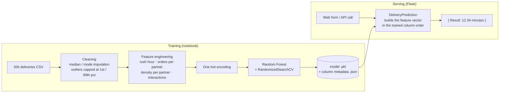

<div align="center">

# 🛵 Delivery ETA Predictor

**Predicts how many minutes a grocery delivery will take, from distance, traffic, weather, order load and
delivery-partner capacity, served as a web app and a REST API.**


</div>

---

## The problem

Quick-commerce apps promise a delivery time the moment you order. Promise too little and customers are angry;
promise too much and they cancel. The estimate has to account for distance, but also for **traffic, weather, rush
hours and how many orders each delivery partner is already carrying**.

This project trains a model on **50,000 deliveries** to make that estimate, and serves it through a form and an API.

## Results

| Metric | Value |
|---|---|
| **Test MAE** | **1.70 minutes** (average delivery: 12.7 min) |
| **Test R²** | **0.762** |
| **5-fold cross-validation R²** | **0.752 ± 0.010** (stable across folds) |
| Model | `RandomForestRegressor`, 200 trees, `max_depth=30`, `max_features="sqrt"` |
| Tuning | `RandomizedSearchCV`, 20 candidates × 3 folds |

## How it works



**Engineered features** turn raw order data into signals the model can use: `is_rush_hour`,
`weekend_rush_hour`, `orders_per_partner`, `density_per_partner`, `distance_per_minute`, and interaction terms
such as `distance_traffic_interaction` and `weekend_traffic_interaction`, plus a combined `WeatherTraffic` category.

**Serving** keeps the model logic (`project_app/utils.py`), configuration (`config.py`) and web layer
(`interface.py`) separate. The saved metadata guarantees that one-hot columns are rebuilt in exactly the order the
model was trained on.

## Features
- Web form for a single prediction, plus a **REST endpoint** (`GET` and `POST`)
- Pre-trained model included: works right after install
- Full, reproducible training pipeline in a Jupyter notebook (EDA, cleaning, tuning, evaluation)

## Tech stack

| Area | Technology |
|---|---|
| Data & EDA | pandas, NumPy, Matplotlib / Seaborn (notebook) |
| Model | scikit-learn `RandomForestRegressor`, `RandomizedSearchCV`, `cross_val_score` |
| Serving | Flask, Jinja2, joblib / pickle |

## Getting started

```bash
git clone https://github.com/ChetanMahajan715/delivery-eta-predictor.git
cd delivery-eta-predictor
python -m venv .venv
# Windows: .venv\Scripts\activate    macOS / Linux: source .venv/bin/activate
pip install -r requirements.txt
python interface.py
```

Open **http://localhost:5000**, fill in the order details and click **Predict Delivery Time**.

## API

`GET` or `POST` `/predict_delivery_time` with the order fields:

```bash
curl "http://localhost:5000/predict_delivery_time?distance_km=5.4&hour_of_day=14&is_weekend=0&accept_hour=15&accept_month=9&No_of_orders=120&traffic_encoded=1&num_delivery_partners=8&population_density=4500&is_rush_hour=1&weekend_rush_hour=0&distance_per_minute=0.12&orders_per_partner=15&density_per_partner=560&weekend_traffic_interaction=0&distance_traffic_interaction=1&City=New%20York&Weather=Sunny&DayOfWeek=Monday&AcceptDayOfWeek=Monday&AreaOfInterest=Suburb&Traffic=Low&TimeOfDay=morning&WeatherTraffic=Sunny_Low"
```
```json
{ "Result": "Predicted Delivery Time: 12.34 minutes" }
```

<details>
<summary><b>All input fields</b></summary>

**Numeric:** `distance_km`, `hour_of_day`, `is_weekend`, `accept_hour`, `accept_month`, `No_of_orders`,
`traffic_encoded`, `num_delivery_partners`, `population_density`, `is_rush_hour`, `weekend_rush_hour`,
`distance_per_minute`, `orders_per_partner`, `density_per_partner`, `weekend_traffic_interaction`,
`distance_traffic_interaction`

**Categorical** (values the model knows):

| Field | Allowed values |
|---|---|
| `City` | New York, Houston, Los Angeles, San Francisco, Unknown |
| `Weather` | Sunny, Rain |
| `DayOfWeek`, `AcceptDayOfWeek` | Monday, Tuesday, Wednesday, Thursday, Saturday, Sunday |
| `AreaOfInterest` | Industrial, Suburb |
| `Traffic` | Low, Medium |
| `TimeOfDay` | morning, evening, night |
| `WeatherTraffic` | Sunny_Low, Sunny_Medium, Sunny_High, Rain_Low, Rain_Medium, Rain_High, Overcast_Low, Overcast_Medium |

</details>

## Project structure

```
delivery-eta-predictor/
├── interface.py                     # Flask app: form + /predict_delivery_time
├── config.py                        # model / metadata paths, port
├── project_app/
│   ├── utils.py                     # DeliveryPrediction: feature vector + predict
│   ├── Linear_Model.pkl             # trained Random Forest (historical file name)
│   ├── project_data.json            # column order + categories
│   ├── delivery_dataset_enhanced.csv  # 50,000 deliveries
│   └── Time estimation.ipynb        # EDA, cleaning, training, evaluation
├── templates/index.html
├── static/
└── requirements.txt
```

To retrain, run the notebook from inside `project_app/` so the relative paths resolve.

## Possible improvements
- Compare gradient boosting (LightGBM / XGBoost) against the Random Forest
- Derive the engineered features on the server so the API only needs raw order data
- Add input validation with clear error messages for unknown categories

## Author

**Chetan Mahajan** · AI / ML engineer

[](https://github.com/ChetanMahajan715)
[](https://www.linkedin.com/in/chetanmahajan715/)

## License
[MIT](LICENSE)
